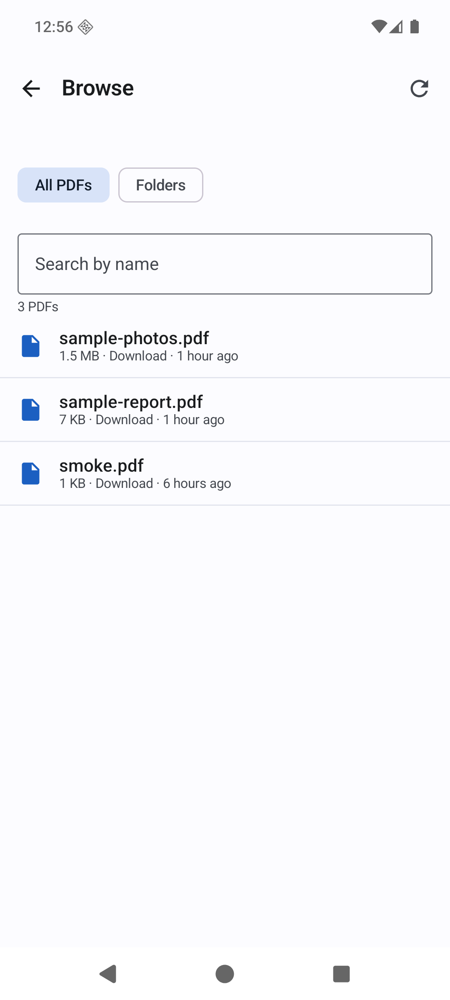
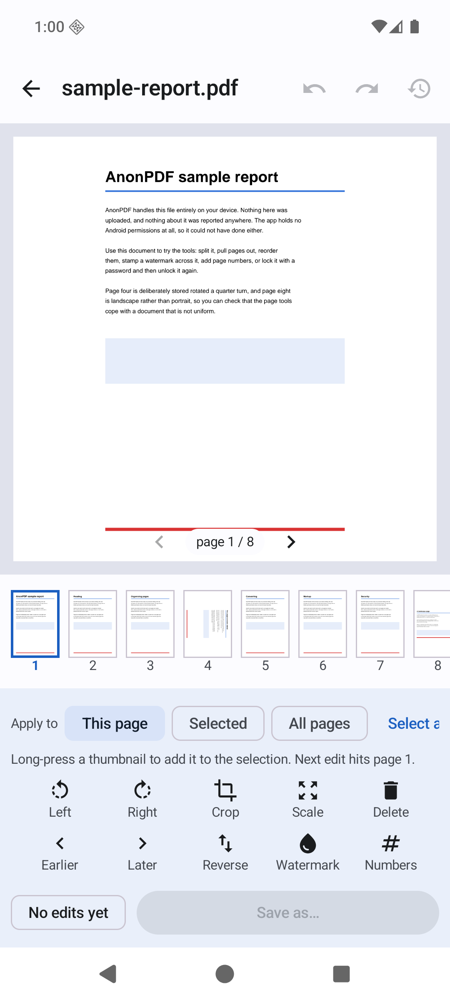
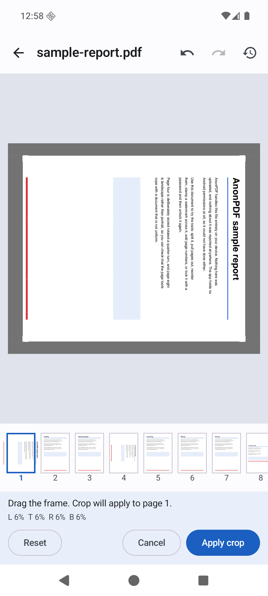
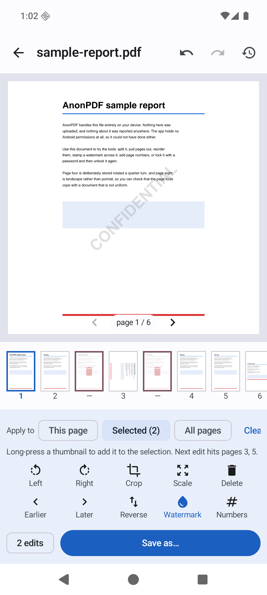

# AnonPDF

[](https://github.com/FanFeast/anonpdf/actions/workflows/build.yml)
[](LICENSE)
[](#requirements)
[](#the-guarantee-and-how-to-check-it)

A PDF reader and editor for Android that does its work on your device and nowhere else.

**No ads. No accounts. No tracking. No paid tier. No network permission.**

AnonPDF exists because every other PDF app on the Play Store seems to want a
subscription, a cloud account, and a look at your documents. This one wants none
of those. It cannot upload your files, because it has no permission to reach the
network — that is not a promise in a privacy policy, it is a fact enforced by the
operating system.

| Library | Reading | Your files |
|---|---|---|
|  |  |  |

## The editor

Most of the work happens here. Pick pages, stack up as many changes as you like,
watch the real rendered output update as you go, and write the file once at the
end. Nothing touches disk until you save, and the original is never modified.

| Editing | Visual crop | Watermark |
|---|---|---|
|  |  |  |

Rotate, crop, scale, delete, restore, reorder, reverse, watermark and page
numbers — each applied to **this page**, a **selection** you long-press together,
or **all pages**. Undo and redo the whole history.

The preview is not an approximation. It is built by the same code that writes the
final file, and a test renders both and asserts they match pixel for pixel.

## The guarantee, and how to check it

AnonPDF declares exactly **one** permission:

```
android.permission.MANAGE_EXTERNAL_STORAGE
```

That is what lets the built-in browser list the PDFs on your device instead of
making you walk the system file picker every time. It is **optional** — decline
it and everything still works through the picker, which needs no permission at
all.

Being straight about one thing: all-files access is a *special app access*, a
toggle under Settings → Apps → Special app access → All files access. It does
**not** appear on the app's normal "Permissions" page, which will read "No
permissions requested" even when it is granted. So do not take that screen as
proof of anything either way.

What you can rely on:

- **No `INTERNET` permission.** The kernel refuses outbound sockets. There is no
  server, no telemetry endpoint, no crash reporter, no ad network. The test suite
  asserts that opening a socket *and* resolving a hostname both actually fail.
- **No analytics or advertising dependencies.** The whole list is in
  `gradle/libs.versions.toml`: AndroidX, Kotlin, and PdfBox-Android.
- **`allowBackup=false`** plus explicit backup exclusion rules, so documents
  cannot leave via cloud backup or device transfer either.
- **A test that fails the build** if any permission other than the one above
  appears in the merged manifest — see
  [`PrivacyContractTest`](app/src/androidTest/java/io/github/fanfeast/anonpdf/PrivacyContractTest.kt).

Verify the built artifact yourself:

```bash
apkanalyzer manifest permissions app-release.apk
```

### What it stores

| What | Where | How to remove |
|---|---|---|
| Names + URIs of up to 20 recent files | App-private storage, excluded from backup | Settings → Clear recent files, or switch off "Remember recent files" |
| Working copies of the file being edited | App cache | Settings → Delete temporary working files; also cleared on every launch |
| Three display preferences | App-private storage | Uninstall |

That is the complete list. No identifier of any kind, no first-run ID, no
advertising ID.

## Features

**Reading**
- Continuous vertical scroll, rendered by Android's own `PdfRenderer`
- Pinch to zoom, with pages redrawn sharply at each zoom level
- Jump to page, text search, night mode
- Opens password-protected PDFs
- Registers as a PDF handler, so other apps can open documents in it

**Finding files**
- Built-in browser: every PDF on the device, newest first, searchable by name
- Or browse by folder
- Or the system picker, if you would rather not grant file access

**Editing** (all in one pass, with live preview)
- Rotate, crop with draggable handles, scale, delete, restore
- Reorder page by page, or reverse the whole document
- Text watermark: diagonal, centred, tiled, top or bottom
- Page numbers with a format template, position, start number, and cover-skipping
- Applied per page, to a selection, or to everything

**Whole-file jobs**
- Merge several PDFs into one
- Split into multiple files by page range, or every N pages
- Extract chosen pages into a new document
- Compress — two modes: re-encode images only (text stays selectable), or
  flatten pages to images for the smallest file. The UI says which trade-off you
  are making.
- PDF → JPG or PNG at a chosen resolution
- Images → PDF, honouring EXIF rotation, with A4 / Letter / fit-image sizing
- Extract text to a `.txt` file
- Protect with AES-256 password, or remove a password you know
- Sign: draw your signature and place it on a page

## Deliberately not included

Being honest about the edges rather than shipping something that half-works:

- **Word / Excel / PowerPoint conversion.** Doing it properly needs a full
  office-document engine. A bad converter is worse than no converter.
- **OCR.** Reading text out of scanned images needs a model, which means either a
  large bundled download or a server. Scanned pages are detected and the app
  says they contain no extractable text rather than silently returning nothing.
- **Cloud sync, accounts, sharing links.** The entire point is that nothing leaves.
- **Cryptographic digital signatures.** "Sign PDF" places an image of your
  signature on the page. It is ink on paper, not a certificate, and the app says
  so on screen.

## Requirements

- Android 12 (API 31) or newer
- About 15 MB installed

## Building

```bash
git clone https://github.com/FanFeast/anonpdf.git
cd anonpdf
./gradlew assembleDebug
```

You need JDK 17+ and an Android SDK with platform 37 and build-tools 36. Point
Gradle at your SDK with `local.properties`:

```properties
sdk.dir=/path/to/Android/Sdk
```

### Tests

```bash
./gradlew testDebugUnitTest          # 27 JVM tests: page ranges, edit-plan folding
./gradlew connectedDebugAndroidTest  # 42 device tests; needs a device or emulator
```

The instrumented suite is where the real coverage lives. It builds PDFs, runs
every operation against them, and asserts on the results: page counts and order
after reorganising, crop boxes, scaling geometry, encryption round-trips,
compression ratios, page numbers reflecting the final order, rendered pixels for
the watermark, and that a preview matches its export exactly. It also asserts the
privacy contract, including that a socket connection and a DNS lookup both fail.

### Release builds

Signing is opt-in. Create `keystore.properties` in the project root (gitignored):

```properties
storeFile=/absolute/path/to/upload.jks
storePassword=…
keyAlias=…
keyPassword=…
```

Then:

```bash
./gradlew bundleRelease   # .aab for Play
./gradlew assembleRelease # .apk for direct install
```

Without that file the release build still works, it just produces an unsigned
artifact.

## How it is put together

Single-module Kotlin app, Jetpack Compose, no dependency-injection framework and
no architecture ceremony beyond what the size justifies.

```
app/src/main/java/io/github/fanfeast/anonpdf/
├── pdf/          The engine. File in, file out, no Android UI types.
│   ├── PdfEditor.kt     Edit ops → normalised plan → apply / preview
│   ├── PdfOps.kt        Merge, split, extract, crop, security, text
│   ├── PdfDraw.kt       Single-page drawing shared by editor and tools
│   ├── PdfConvert.kt    Compression, page export, images → PDF
│   ├── PdfRasterizer.kt Wraps android.graphics.pdf.PdfRenderer
│   ├── DocumentStore.kt Moves bytes between SAF and the private cache
│   └── PageRanges.kt    Parses "1-3, 5, 9-12"
├── storage/      Optional all-files access and the PDF scanner
├── data/         Recent files and preferences (DataStore)
└── ui/           Compose screens: viewer, editor, browser, tools
```

Four decisions worth explaining:

**Rendering uses the platform.** `android.graphics.pdf.PdfRenderer` is already on
every device, sandboxed by the OS, and costs nothing in APK size. PdfBox-Android
handles document *structure* — it is not used for rasterising.

**Edits are a list of operations, not mutations.** The editor keeps an ordered op
list and derives a normalised `EditPlan` from it. Undo is dropping the last op
and recomputing. Preview and export both consume that same plan, which is why
they cannot drift apart.

**Preview builds a one-page document.** Rather than applying the plan to the whole
file, preview extracts the page being shown, applies the plan's page-scoped and
document-scoped operations, and renders that. A 400-page file previews as fast as
a 4-page one.

**Page edits happen in place.** Reordering or deleting pins each page's inherited
attributes, detaches every page from the page tree, then re-attaches them in the
new order. The obvious alternative — copying pages into a fresh document —
silently drops annotations and page-tree-inherited resources.

BouncyCastle, which ships with PdfBox, is excluded from the build. PdfBox only
reaches it for certificate-based encryption, which this app does not offer;
password protection uses the platform's own JCE. Dropping it removed about 4 MB
of unused code, most of it post-quantum algorithms, and the encryption tests
prove the remaining paths still work.

## Licence

MIT. See [LICENSE](LICENSE).

Third-party components and their licences are listed in the app under
**About → Open source licences**.
