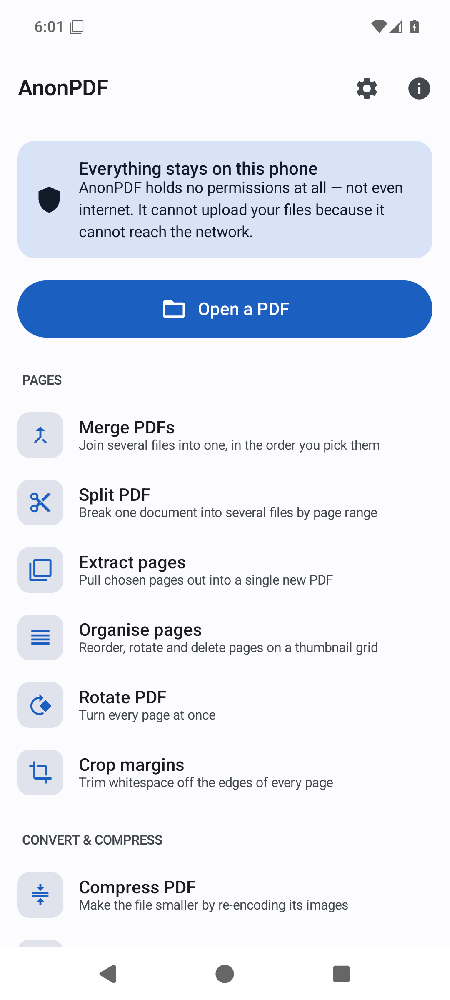
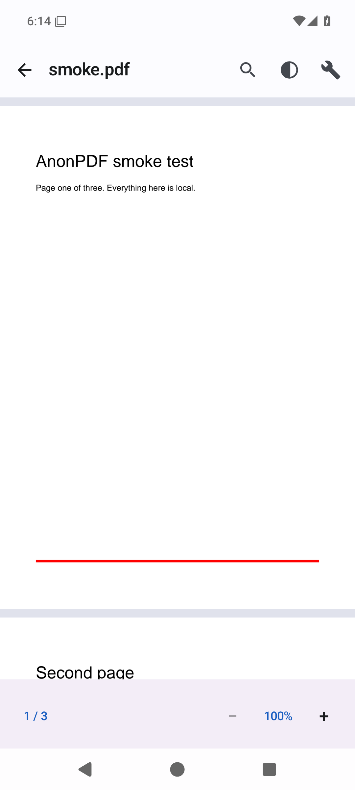
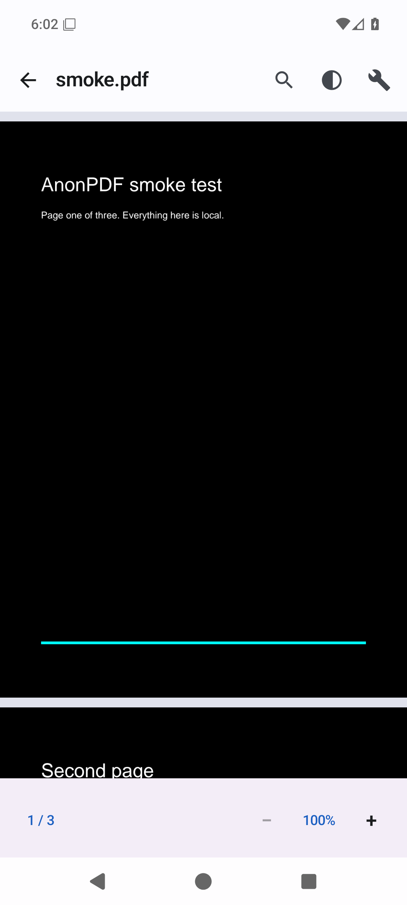
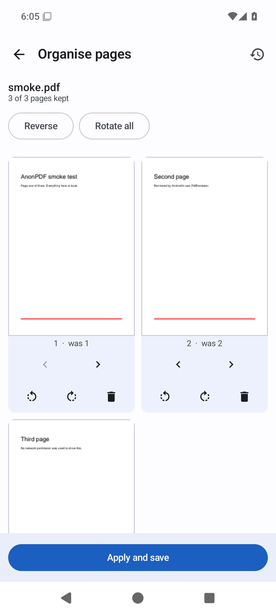
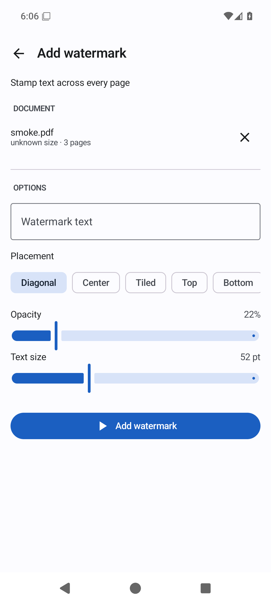
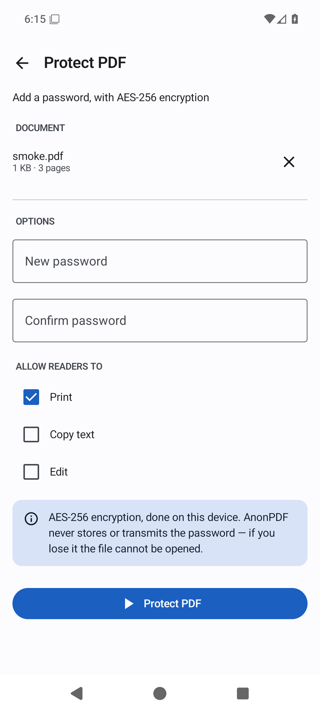

# AnonPDF

A PDF reader and editor for Android that does its work on your device and nowhere else.

**No ads. No accounts. No tracking. No paid tier. No network permission.**

AnonPDF exists because every other PDF app on the Play Store seems to want a
subscription, a cloud account, and a look at your documents. This one wants
none of those things. It cannot upload your files, because it has no permission
to reach the network — that is not a promise in a privacy policy, it is a fact
enforced by Android.

| Library | Reading | Night mode |
|---|---|---|
|  |  |  |

| Organise pages | Watermark | Protect |
|---|---|---|
|  |  |  |

## The privacy claim, and how to check it

AnonPDF declares **zero permissions**. You can verify this yourself:

```bash
# Against a built APK:
apkanalyzer manifest permissions app-release.apk
```

The only entry you will see is
`io.github.fanfeast.anonpdf.DYNAMIC_RECEIVER_NOT_EXPORTED_PERMISSION`, a
signature-level permission that AndroidX declares so an app can register a
broadcast receiver against *itself*. No other app can hold it and it grants
access to nothing.

Or check on your phone: **Settings → Apps → AnonPDF → Permissions.**

What that means concretely:

- **No `INTERNET` permission.** The kernel refuses outbound sockets. There is no
  server, no telemetry endpoint, no crash reporter, no ad network. The test suite
  asserts that opening a socket actually fails.
- **No storage permission.** Files reach the app one at a time through Android's
  Storage Access Framework — the system file picker. AnonPDF cannot list your
  storage, only read what you hand it.
- **`allowBackup=false`** and explicit backup exclusion rules, so documents
  cannot leave the device via cloud backup or device transfer either.
- **No analytics or advertising dependencies.** Check `gradle/libs.versions.toml`;
  the whole list is AndroidX, Kotlin, and PdfBox-Android.

### What it stores

| What | Where | How to remove |
|---|---|---|
| Names + URIs of up to 20 recent files | App-private storage, excluded from backup | Settings → Clear recent files, or switch off "Remember recent files" |
| Working copies of the file being edited | App cache | Settings → Delete temporary working files; also cleared on every app launch |
| Three display preferences | App-private storage | Uninstall |

That is the complete list. There is no identifier of any kind, no first-run ID,
no advertising ID.

## Features

**Reading**
- Continuous vertical scroll, rendered by Android's own `PdfRenderer`
- Pinch to zoom, with pages re-rendered sharply at each zoom level
- Jump to page, text search, night mode (colour inversion)
- Opens password-protected PDFs
- Registers as a PDF handler, so other apps can open documents in it

**Pages**
- Merge several PDFs into one
- Split into multiple files by page range, or every N pages
- Extract chosen pages into a new document
- Organise: reorder, rotate and delete pages on a thumbnail grid
- Rotate every page at once
- Crop margins

**Convert & compress**
- Compress — two modes: re-encode images only (text stays selectable), or
  flatten pages to images for the smallest possible file. The UI says which
  trade-off you are making.
- PDF → JPG or PNG at a chosen resolution
- Images → PDF, honouring EXIF rotation, with A4 / Letter / fit-image page sizing
- Extract text to a `.txt` file

**Markup**
- Text watermark: diagonal, centred, tiled, top or bottom, with opacity and size
- Page numbers with a format template (`{n}`, `{total}`), position, start number,
  and the option to skip a cover page
- Sign: draw your signature and place it on a page

**Security**
- Protect with a password using AES-256, with print / copy / edit permissions
- Remove a password from a PDF you can already open

## Deliberately not included

Being honest about the edges rather than shipping something that half-works:

- **Word / Excel / PowerPoint conversion.** Doing this properly needs a
  full office-document engine. A bad converter is worse than no converter.
- **OCR.** Reading text out of scanned images needs a model, which means either
  a large bundled download or a server. Scanned pages are detected and the app
  tells you they contain no extractable text rather than returning nothing
  silently.
- **Cloud sync, accounts, sharing links.** The entire point is that nothing leaves.
- **Cryptographic digital signatures.** "Sign PDF" places an image of your
  signature on the page. It is ink on paper, not a certificate, and the app
  says so on the screen.

## Requirements

- Android 12 (API 31) or newer
- About 15 MB installed

## Building

```bash
git clone https://github.com/FanFeast/anonpdf.git
cd anonpdf
./gradlew assembleDebug
```

You need JDK 17+ and an Android SDK with platform 37 and build-tools 36. Point
Gradle at your SDK with a `local.properties` file:

```properties
sdk.dir=/path/to/Android/Sdk
```

### Tests

```bash
./gradlew testDebugUnitTest          # page-range parsing
./gradlew connectedDebugAndroidTest  # needs a device or emulator
```

The instrumented suite is where the real coverage lives: it builds PDFs, runs
every operation against them, and asserts on the results — page counts and
ordering after reorganising, crop boxes, encryption round-trips, compression
ratios, and rendered pixels for the watermark. It also asserts the privacy
contract, including that a socket connection fails.

### Release builds

Signing is opt-in. Create `keystore.properties` in the project root (it is
gitignored):

```properties
storeFile=/absolute/path/to/upload.jks
storePassword=…
keyAlias=…
keyPassword=…
```

Then:

```bash
./gradlew bundleRelease   # .aab for Play
./gradlew assembleRelease # .apk for direct install
```

Without that file the release build still works, it just produces an unsigned
artifact.

## How it is put together

Single-module Kotlin app, Jetpack Compose, no dependency-injection framework
and no architecture ceremony beyond what the size justifies.

```
app/src/main/java/io/github/fanfeast/anonpdf/
├── pdf/          The engine. File in, file out, no Android UI types.
│   ├── PdfOps.kt        Page organisation, crop, watermark, numbering,
│   │                    stamping, encryption, text extraction
│   ├── PdfConvert.kt    Compression, page export, images → PDF
│   ├── PdfRasterizer.kt Wraps android.graphics.pdf.PdfRenderer
│   ├── DocumentStore.kt Moves bytes between SAF and the private cache
│   └── PageRanges.kt    Parses "1-3, 5, 9-12"
├── data/         Recent files and preferences (DataStore)
└── ui/           Compose screens: viewer, generic tool flow, organise, sign
```

Two decisions worth explaining:

**Rendering uses the platform.** `android.graphics.pdf.PdfRenderer` is already on
every device, sandboxed by the OS, and costs nothing in APK size. PdfBox-Android
handles document *structure* — it is not used for rasterising.

**Page edits happen in place.** Reordering or deleting pages pins each page's
inherited attributes, detaches every page from the page tree, then re-attaches
them in the new order. The obvious alternative — copying pages into a fresh
document — silently drops annotations and page-tree-inherited resources.

BouncyCastle, which ships with PdfBox, is excluded from the build. PdfBox only
reaches it for certificate-based encryption, which this app does not offer;
password protection uses the platform's own JCE. Dropping it removed about 4 MB
of unused code, most of it post-quantum algorithms, and the encryption tests
prove the remaining paths still work.

## Licence

MIT. See [LICENSE](LICENSE).

Third-party components and their licences are listed in the app under
**About → Open source licences**.
